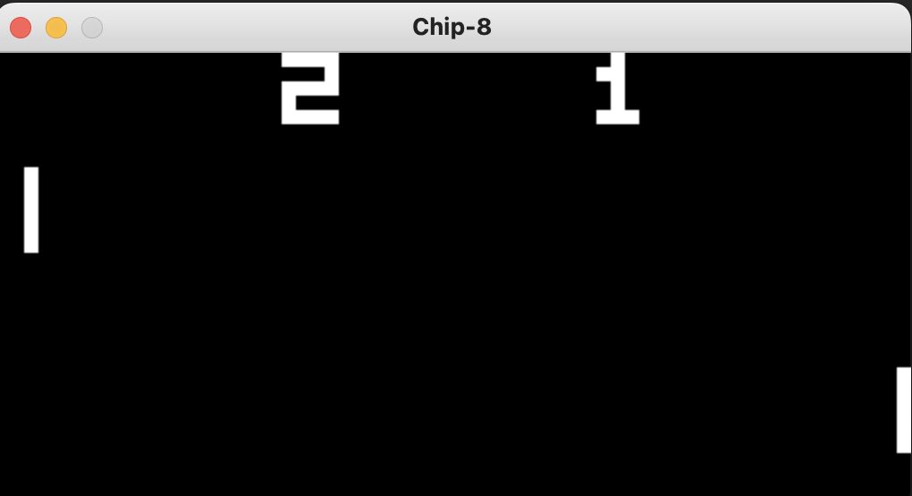

# A Chip-8 Emulator

This was written using C and SDL2

Before compiling, make sure you have [SDL2](https://wiki.libsdl.org/SDL2/Installation) on your system

# Compiling
- For Linux, install `libsdl2-dev`

- For Mac, run `brew install sdl2` or `sudo port install libsdl2`

- For Window, my condolences

# Running
Run `make` to compile and `./chip8 <rom_name>.ch8` to run the program

# ROMs

You can find the ROMs for testing the program in the [roms](roms) directory

# References:
- [Cowgod's Chip-8 Technical Reference](http://devernay.free.fr/hacks/chip8/C8TECH10.HTM)
- [CHIP-8 Wikipedia](https://en.wikipedia.org/wiki/CHIP-8)
